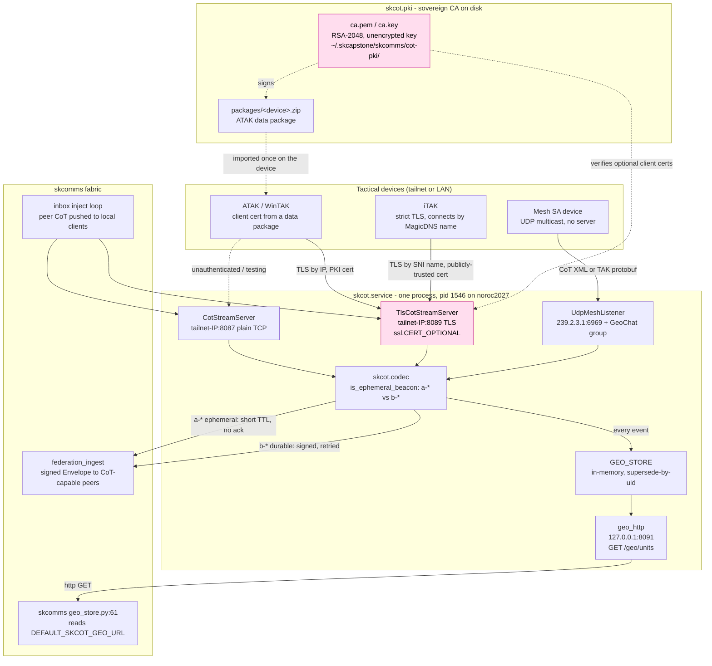

# skcot - Standard Operating Procedures

skcot is the sovereign **Cursor-on-Target (CoT) / TAK** service: it terminates the wire protocol
that ATAK, iTAK, and WinTAK speak, keeps one situational picture of everything it sees, and puts an
AI teammate on the tactical net as a real contact. It is a **systemd service** (`skcot.service`),
its one hard dependency is [skcomms](https://github.com/smilinTux/skcomms), and skcomms in turn
reads its geo bridge over loopback HTTP.

`Status:` Active · `Kind:` service · `Maturity-tier:` **T0 - Classical** · `Runtime:` Python >= 3.10
`Canonical-home:` <https://github.com/smilinTux/skcot>

---

## 1. Overview

### What it owns

| Responsibility | Where |
|---|---|
| Terminating the CoT/TAK wire protocol (plain TCP, TLS, UDP multicast mesh) | `src/skcot/server.py` |
| Translating CoT XML and TAK Protocol protobuf to and from the skcomms Envelope | `src/skcot/codec.py` |
| Classifying CoT into the ephemeral beacon rail (`a-*`) vs the durable event rail (`b-*`) | `src/skcot/codec.py` (`is_ephemeral_beacon`) |
| The in-memory situational store, superseded by entity `uid` | `src/skcot/geo.py` (`GEO_STORE`) |
| A read-only loopback HTTP view of that store | `src/skcot/geo_http.py` |
| Its own X.509 certificate authority, per-device certs, and ATAK enrollment `.zip` packages | `src/skcot/pki.py` |
| Beaconing the AI teammate's position and answering GeoChat through an LLM | `src/skcot/agent.py` |

### What it explicitly does NOT do

- **It is not the identity root of trust.** Agent identity, FQIDs, and envelope signing keys come
  from skcomms and capauth. `service.py:227` calls `skcomms.identity.resolve_self_identity()`.
- **It has no home directory of its own.** Every path it writes resolves through
  `skcomms.home.skcomms_home()`, so the PKI lives under `~/.skcapstone/skcomms/cot-pki/`, not under
  a `~/.skcapstone/skcot/`. That coupling is deliberate but it means **skcot cannot be operated
  without skcomms installed and configured**.
- **It does not durably store beacons.** An ephemeral position beacon lands in `GEO_STORE` and never
  becomes a mailbox file. That is the entire reason the package exists; see
  [docs/ARCHITECTURE.md](docs/ARCHITECTURE.md).
- **It does not authenticate the transport.** The TLS listener is built with
  `require_client_cert` left at its `False` default (`server.py:289`), so it runs
  `ssl.CERT_OPTIONAL`. A client certificate **attributes** a device, it does not **admit** one.
  Access control is the tailnet bind. See [SECURITY.md](SECURITY.md).
- **It does not expose a `/health` endpoint.** There is no health route. The nearest liveness probe
  is `GET http://127.0.0.1:8091/geo/units`.
- **It has no console script.** `pyproject.toml` carries no `[project.scripts]` block. Every entry
  point is `python -m skcot.<module>`.

---

## 2. Architecture

### Start here (the 5 files to open first)

| File | One-liner |
|---|---|
| `src/skcot/service.py` | The daemon. `main()` at :225 binds every listener, wires ingest into `GEO_STORE`, and starts the geo HTTP bridge. Read this first; it is the whole wiring diagram in one function. |
| `src/skcot/server.py` | The listeners: `CotStreamServer` (plain, `DEFAULT_COT_PORT = 8087`), `TlsCotStreamServer` (`DEFAULT_COT_TLS_PORT = 8089`, SNI split at :331), `UdpMeshListener` (`239.2.3.1:6969`), and `federation_ingest`. |
| `src/skcot/codec.py` | The wire translation and `is_ephemeral_beacon`, the one classifier every routing decision traces back to. |
| `src/skcot/pki.py` | The in-house certificate authority: `init_ca()` at :151, `_gen_key()` at :94, and `build_data_package()`, which produces the ATAK enrollment `.zip`. |
| `src/skcot/geo_http.py` | The read-only bridge skcomms consumes. `DEFAULT_HTTP_HOST = "127.0.0.1"`, `DEFAULT_HTTP_PORT = 8091`, one route: `GET /geo/units`. |

### System diagram



The two pink nodes are the honest weak points, documented rather than hidden: the TLS listener does
not require a client certificate, and the CA private key is on disk unencrypted. See
[SECURITY.md](SECURITY.md).

### Why the two rails exist

CoT atoms (`a-*`, position beacons) are disposable and constant; CoT bits (`b-*`, GeoChat, markers,
files) happen once and must arrive. Routing both down skcomms' durable mail path filled a mailbox
with tens of thousands of already-stale position updates. The fix was a second transport discipline,
not a patch to skcomms' retry logic. Full mechanism in
[docs/ARCHITECTURE.md](docs/ARCHITECTURE.md).

---

## 3. Build

There is no compile step. skcot is a pure-Python setuptools package (`build-backend =
"setuptools.build_meta"`), and `version = "0.1.0"` is **hardcoded in `pyproject.toml`**, not derived
from a tag. See section 9.

### Local, editable (how the reference node runs it)

```bash
cd ~/clawd/skcapstone-repos/skcot
~/.skenv/bin/pip install -e '.[tak]'
```

`[tak]` pulls `takproto`, needed only for the TAK Protocol protobuf mesh path. Without it, the TCP,
TLS, and XML mesh paths all still work.

### A wheel

```bash
python -m build            # produces dist/skcot-0.1.0-py3-none-any.whl
```

### Dependencies

| Package | Declared where | Required? |
|---|---|---|
| `skcomms` | `pyproject.toml` `dependencies` | Yes, the only hard dependency |
| `takproto` | `pyproject.toml` `[project.optional-dependencies] tak` | No, protobuf mesh path only |
| `cryptography` | **not declared** - imported by `src/skcot/pki.py`, satisfied transitively | Yes in practice, see section 9 |
| `pgpy` | **not declared** - reached through skcomms at test time | Yes to run the test suite, see section 4 |

---

## 4. Test

**The green-bar gate: `pytest tests/` must be 98 passed, 0 failed.** 12 test files. `pyproject.toml`
sets `[tool.pytest.ini_options] pythonpath = ["src"]`, so no install is needed to run them.

```bash
cd ~/clawd/skcapstone-repos/skcot     # or your worktree
python -m pytest tests/ -q
```

Verified 2026-08-14 on Python 3.12.3, both in the `~/.skenv` venv and in a clean venv:
`98 passed, 4 warnings in ~5s`.

### The clean-environment trap

`pip install pytest pytest-asyncio skcomms takproto` alone gives **4 failures and 2 errors**, all of
them `ModuleNotFoundError: No module named 'pgpy'`. `pgpy` is reached through skcomms at test time
but is not pulled in by installing `skcomms` from PyPI, and skcot does not declare it either. **CI
must install `pgpy` explicitly**, which `.github/workflows/ci.yml` does. Confirmed 2026-08-14: with
`pgpy` added, the same clean venv reports `98 passed`.

### What CI actually runs

| Workflow | Gate | Notes |
|---|---|---|
| `.github/workflows/ci.yml` | `pytest tests/` on Python 3.10 and 3.12 | Added 2026-08-14. Before that date **nothing ran the test suite at all**, on any push. |
| `.github/workflows/secret-scan.yml` | `gitleaks detect` over the full history, `--exit-code 1` | Real gate, calls the pinned binary, not the licensed action. |
| `.github/workflows/docs-check.yml` | sk-standards docs-check, `tiers: "1,2"` | Presence + changelog. Tier 3 (the evidence block at the bottom of this file) is written but not yet enforced in CI; promoting to `"1,2,3"` is the follow-up. |

Nothing here is `|| true`. Every gate above can fail the build.

---

## 5. Release / Deploy

**skcot is not published to PyPI** (`pip index versions skcot` -> no matching distribution, checked
2026-08-14) and **the repository has no tags**. It is deployed as an editable install from a git
checkout plus a systemd user unit. Do not document a publish flow that does not exist.

### Unit names (read this before you copy anything)

| Context | Name |
|---|---|
| Installed and running on the reference node (noroc2027) | **`skcot.service`** |
| Shipped in this repo, from 2026-08-14 | **`systemd/skcot.service`** (renamed to match) |
| Shipped in this repo, before 2026-08-14 | `systemd/skcot-service.service` (never matched any deployment) |
| Agent template | `systemd/skcot-agent@.service`, instantiated as `skcot-agent@<name>` |

The old `skcot-service.service` name survives only in [docs/MIGRATION.md](docs/MIGRATION.md)'s
history table. If you are on a node that still has a unit by that name, it predates the rename.

### The shipped unit ships placeholders on purpose

`systemd/skcot.service` carries `SKCOMMS_COT_HOST=REPLACE_ME_WITH_THIS_NODES_TAILNET_IP` and
`SKCOMMS_COT_SNI_NAME=REPLACE_ME_WITH_THIS_NODES_MAGICDNS_NAME`. These are not oversights:

- Leaving `SKCOMMS_COT_HOST` **unset** falls back to `0.0.0.0` (`service.py:231`), which would bind
  the tactical endpoint on every interface including a public one. Fail-closed beats fail-open.
- Until 2026-08-14 the shipped unit hardcoded `198.51.100.10`, which is **RFC 5737 TEST-NET-2**, a
  reserved documentation address that routes nowhere. Anyone deploying it as-shipped got a service
  pointing at a documentation IP with no TLS configured at all. That is fixed: the TLS and SNI cert
  paths, `Wants=network-online.target`, and `WorkingDirectory` are now present.

Set the real values in `~/.config/skcot/skcot.env`, which the unit reads **after** its own
`Environment=` lines so the file always wins:

```bash
mkdir -p ~/.config/skcot
cat > ~/.config/skcot/skcot.env <<'EOF'
SKCOMMS_COT_HOST=100.108.59.57
SKCOMMS_COT_MESH_IFACE=100.108.59.57
SKCOMMS_COT_SNI_NAME=noroc2027.tail204f0c.ts.net
EOF
```

### Deploy

```bash
# 1. install the package into the venv the unit's PATH points at
~/.skenv/bin/pip install -e '~/clawd/skcapstone-repos/skcot[tak]'

# 2. mint the CA and the server cert (idempotent; never regenerates an existing CA)
~/.skenv/bin/python -m skcot.pki init

# 3. install the unit and the site-specific env file (above)
cp ~/clawd/skcapstone-repos/skcot/systemd/skcot.service ~/.config/systemd/user/
systemctl --user daemon-reload

# 4. start it
systemctl --user enable --now skcot

# 5. verify: three listeners, tailnet + loopback only
ss -ltnp | grep -E '8087|8089|8091'
curl -s http://127.0.0.1:8091/geo/units | head -c 200
journalctl --user -u skcot -n 30 --no-pager
```

Step 5 on the reference node returns exactly three sockets, and the bind addresses are the point:

```
LISTEN 100.108.59.57:8087   users:(("python",pid=1546,...))
LISTEN 100.108.59.57:8089   users:(("python",pid=1546,...))
LISTEN 127.0.0.1:8091       users:(("python",pid=1546,...))
```

### Rollback

```bash
systemctl --user stop skcot
cd ~/clawd/skcapstone-repos/skcot && git checkout <last-good-sha>
~/.skenv/bin/pip install -e '.[tak]'
systemctl --user start skcot
systemctl --user status skcot
```

`GEO_STORE` is in-memory only, so a restart loses the situational picture and rebuilds it from the
next round of beacons. Nothing on disk needs migrating. **The one thing a rollback must never touch
is `~/.skcapstone/skcomms/cot-pki/ca.pem` and `ca.key`**: that CA is pinned in the truststore of
every enrolled device, so regenerating it silently un-enrolls the entire fleet.

### Front-end / Exposure

- **Tier:** not applicable to the unified ingress tiers. skcot is **tailnet + loopback only**. It
  has no Caddy vhost, no SKStacks/Traefik route, and no Tailscale Funnel route.
- **Public `:443` routes:** **none.** Nothing about skcot is reachable from the public internet.
- **Bind addresses (all three confirmed live via `ss`, 2026-08-14):**

  | Surface | Bind | Reachable from |
  |---|---|---|
  | CoT plain TCP | `100.108.59.57:8087` (tailnet IP) | tailnet |
  | CoT TLS | `100.108.59.57:8089` (tailnet IP) | tailnet |
  | Geo HTTP (read-only) | `127.0.0.1:8091` | same host only |
  | Mesh SA | UDP multicast `239.2.3.1:6969` joined on the tailnet interface | link-local multicast |

  None of these is `0.0.0.0`. If you ever see `0.0.0.0:8087` in `ss` output,
  `SKCOMMS_COT_HOST` was not set and the service fell through to its default. Fix it immediately.

---

## 6. Configuration / Usage

**Every setting is an environment variable, and the prefix is still `SKCOMMS_COT_*`, not
`SKCOT_*`.** That is a leftover from the extraction out of skcomms, and it is load-bearing:
`service.py` and `server.py` read the `SKCOMMS_` names, so renaming them would silently un-configure
every deployment. The only `SKCOT_`-prefixed variables are the two that were added after the split,
for the geo HTTP bridge.

| Variable | Read at | Default | Live value on noroc2027 |
|---|---|---|---|
| `SKAGENT` | `agent.py:150` | `lumina` | `lumina` |
| `SKCOMMS_COT_HOST` | `service.py:231` | `0.0.0.0` (**do not rely on this**) | `100.108.59.57` |
| `SKCOMMS_COT_PORT` | `service.py:232` | `8087` | `8087` |
| `SKCOMMS_COT_TLS` | `service.py:264` | `0` (off) | `1` |
| `SKCOMMS_COT_TLS_PORT` | `service.py:265` | `8089` | `8089` |
| `SKCOMMS_COT_TLS_CERT` | `service.py:277` | unset -> PKI self-signed `server.pem` | `~/.skcapstone/skcomms/cot-pki/ts-cot.crt` |
| `SKCOMMS_COT_TLS_KEY` | `service.py:278` | unset | `~/.skcapstone/skcomms/cot-pki/ts-cot.key` |
| `SKCOMMS_COT_CA` | `service.py:279` | falls back to `pki_dir()/ca.pem` | unset (falls back) |
| `SKCOMMS_COT_SNI_CERT` | `server.py:331` | unset | same as `TLS_CERT` |
| `SKCOMMS_COT_SNI_KEY` | `server.py:332` | unset | same as `TLS_KEY` |
| `SKCOMMS_COT_SNI_NAME` | `server.py:333` | unset | `noroc2027.tail204f0c.ts.net` |
| `SKCOMMS_COT_MESH` | `service.py:293` | `1` (on); set `0` to disable | unset (on) |
| `SKCOMMS_COT_MESH_IFACE` | `service.py:304` | `0.0.0.0` | `100.108.59.57` |
| `SKCOMMS_COT_PEERS` | `server.py:583` | unset | unset |
| `SKCOMMS_COT_STRICT` | `server.py:619` | unset | unset |
| `SKCOMMS_COT_DEBUG_RAW` | `server.py:145` | unset | unset |
| `SKCOMMS_COT_LLM` | `agent.py:35` | `http://192.168.0.100:8082/v1/chat/completions` | n/a, no agent installed |
| `SKCOMMS_COT_LLM_MODEL` | `agent.py:36` | `qwen3.6-27b-abliterated` | n/a |
| `SKCOT_HTTP_HOST` | `service.py:316` | `127.0.0.1` | unset (default) |
| `SKCOT_HTTP_PORT` | `service.py:317` | `8091` | unset (default) |
| `SKFED_INBOX_URL` | `service.py:207` | unset | unset |

All three SNI variables must be set together or the SNI callback is never installed
(`server.py:334`).

### The SNI split, and why there are two server certs

`server.py:331-345` installs an SNI callback. A client that connects **by the MagicDNS hostname**
gets the publicly-trusted certificate (`ts-cot.crt`, a `tailscale cert` Let's Encrypt pair), which
is what strict clients such as iTAK need because they will not import a private CA. A client that
connects **by IP** gets the PKI certificate its imported data package already trusts. One listener,
one client pool, one situational picture.

### Paths on disk

All under `skcomms_home()`, which is `~/.skcapstone/skcomms` by default:

```
~/.skcapstone/skcomms/cot-pki/
  ca.pem  ca.key          # the sovereign TAK CA. NEVER regenerate; every device pins it.
  server.pem  server.key  # the :8089 PKI server cert
  ts-cot.crt  ts-cot.key  # the publicly-trusted SNI pair (site-specific, not created by skcot)
  devices/<name>.p12      # per-device client keystore
  packages/<name>.zip     # generated ATAK data packages
```

`ca.key` and `server.key` are `chmod 0600` but **not encrypted**. See [SECURITY.md](SECURITY.md).

---

## 7. API / Reference

### Module entry points

There is **no console script**. `pyproject.toml` has no `[project.scripts]` block, so every entry
point is `python -m`.

| Command | Purpose |
|---|---|
| `python -m skcot.service` | The daemon. This is what `skcot.service`'s `ExecStart` runs. No arguments. |
| `python -m skcot.pki init` | Create the CA and server cert. Idempotent: an existing CA is loaded, never regenerated. |
| `python -m skcot.pki mint <device>` | Mint a per-device client certificate. |
| `python -m skcot.pki package <device> [--host H] [--port P]` | Build the ATAK data-package `.zip`. |
| `python -m skcot.pki serve [--host H] [--port P]` | Run the TLS CoT server standalone. |
| `python -m skcot.agent --host H [--port 8089] [--callsign C] [--lat L] [--lon L] [--interval 20]` | The AI teammate. `--host` is **required** (`agent.py:165`). |
| `python -m skcot.client --host H [--port 8089] [--package ZIP] [--callsign C] [--lat] [--lon] [--interval 5] [--count N] [--chat MSG] [--uid U]` | A test client. Omit `--package` for plain TCP. |

### The geo HTTP surface

Read-only, GET-only, bound to `127.0.0.1:8091`. Fail-soft: a bind failure logs a warning and does
**not** take down the CoT listeners (`service.py:318-324`).

| Request | Response |
|---|---|
| `GET /geo/units` | `{"units": [...], "count": N}` |
| `GET /geo/units?format=geojson` | a GeoJSON `FeatureCollection` |
| `GET /geo/units?include_stale=1` | includes fixes past their stale / TTL |
| anything else | a small JSON `404`, or `405` for a non-GET method |

This is the contract `skcomms/src/skcomms/geo_store.py:61` consumes as
`DEFAULT_SKCOT_GEO_URL = "http://127.0.0.1:8091/geo/units"`. Changing the route or the port breaks
skcomms' SkMap telemetry.

### Network ports

| Port | Proto | Bind | Constant |
|---|---|---|---|
| 8087 | TCP | tailnet IP | `server.py:34` `DEFAULT_COT_PORT = 8087` |
| 8089 | TCP + TLS | tailnet IP | `server.py:35` `DEFAULT_COT_TLS_PORT = 8089` |
| 8091 | HTTP | `127.0.0.1` | `geo_http.py:32-33` |
| 6969 | UDP multicast `239.2.3.1` | mesh iface | `server.py:413-414` `TAK_MESH_GROUP` / `TAK_MESH_PORT` |

---

## 8. Troubleshooting

| Symptom | Check |
|---|---|
| Service will not start, `journalctl` shows a bind or resolution error naming `REPLACE_ME_...` | The placeholder is still in place. Write the real tailnet IP into `~/.config/skcot/skcot.env` and `systemctl --user restart skcot`. This is the intended fail-closed behaviour, not a bug. |
| `ss -ltnp` shows `0.0.0.0:8087` instead of a tailnet IP | `SKCOMMS_COT_HOST` is unset and the `service.py:231` default took over. The endpoint is exposed on every interface. Set it and restart **now**. |
| ATAK connects on 8089 then immediately drops | Check the server cert the device is being offered. `openssl s_client -connect <ip>:8089` for the IP path, and `-servername <magicdns>` for the SNI path. An expired or wrong-CA cert on either leg looks identical from the phone. |
| iTAK refuses the connection but ATAK is fine | iTAK will not import a private CA, so it must hit the SNI leg. Confirm all three of `SKCOMMS_COT_SNI_CERT`, `_SNI_KEY`, `_SNI_NAME` are set: if any one is missing, `server.py:334` never installs the callback and every client gets the PKI cert. |
| SNI leg fails for every client at once, on a date boundary | The `tailscale cert` pair expires roughly every 90 days and skcot does **not** renew it. On the reference node `ts-cot.crt` had `notAfter = Jul 26 2026`, so it is **currently expired**. Re-run `tailscale cert <magicdns-name>`, copy the pair into `cot-pki/`, restart. See the Unverified section. |
| Devices see each other but not the AI teammate | No `skcot-agent@` instance is installed on the reference node. `systemctl --user is-enabled skcot-agent@lumina` returning `not-found` is the expected current state, not a fault. Install the template and override its placeholder `ExecStart` first. |
| skcomms SkMap shows no live units | `curl -s http://127.0.0.1:8091/geo/units`. Empty means the store is empty (no beacons received yet, or all stale). Connection refused means the geo bridge failed to bind; it is fail-soft, so grep the journal for `geo HTTP endpoint not started`. |
| Mesh devices are invisible | `SKCOMMS_COT_MESH_IFACE` is probably `0.0.0.0` or the wrong interface. Check the journal for `mesh bridge active (iface=...)` or `mesh listener not started`. Multicast does not cross the tailnet, only the physical LAN. |
| Beacons are piling up in a durable mailbox | This is the exact defect skcot was created to fix. `is_ephemeral_beacon` in `codec.py` is misclassifying. See `tests/test_beacon_no_durable_persist.py` and `tests/test_cot_beacon_outbox.py`. |
| The whole fleet stops trusting the server after a redeploy | Someone regenerated `cot-pki/ca.pem`. Every device pins it. Restore the old `ca.pem`/`ca.key` from backup, or re-enroll every device. `init_ca()` is idempotent by design (`pki.py:151`) precisely to prevent this. |
| Test suite fails with `ModuleNotFoundError: No module named 'pgpy'` | Undeclared transitive test dependency. `pip install pgpy`. See section 4. |

---

## 9. Maturity-tier + Version reference

### Maturity tier: T0 - Classical

Per [CRYPTOGRAPHY_STANDARD](https://github.com/smilinTux/sk-standards/blob/main/standards/CRYPTOGRAPHY_STANDARD.md),
**T0 means asymmetric crypto is classical**. skcot is T0 and nothing about it is post-quantum:

- **Asymmetric: RSA-2048, classical.** `pki.py:94` `_gen_key()` calls
  `rsa.generate_private_key(public_exponent=65537, key_size=2048)`. The CA at `pki.py:151`, the
  server cert, and every per-device cert use it. Signature algorithm is `sha256WithRSAEncryption`
  (confirmed by reading the live `ca.pem`).
- **No suite-ids, no suite registry, no backend ABC, no self-report command.** skcot is therefore
  **not T1 (Agile)** either. There is no `skcot doctor` and no negotiated-primitive report.
- **No hybrid KEM, no post-quantum signatures.** Not T2, not T3.
- **CRYPTOGRAPHY_STANDARD compliance:** skcot **does not currently meet** the standard's crypto-
  agility requirement for new components (wire tags, suite registry, negotiation surface). Whether
  RSA-2048 specifically clears the standard's asymmetric floor is **not determinable from the
  standard's text**, which specifies targets for KEM and signatures but does not set a minimum RSA
  modulus for X.509 PKI. That question is in the Unverified section below; this SOP does not assert
  compliance either way.

The transport surfaces skcot terminates (TLS on 8089, the tailnet, the CoT stream itself) are all
classical. skcomms' [SECURITY.md](https://github.com/smilinTux/skcomms/blob/main/SECURITY.md)
already scopes the CoT/TAK stream out of its own hybrid claim, and that remains accurate.

### Version

- `pyproject.toml` sets `version = "0.1.0"`, **hardcoded**, not derived by setuptools-scm.
- **The repository has zero git tags**, so there is no tag to derive from and nothing pins that
  string to a commit.
- **Not published to PyPI.** Deployed as an editable install from a checkout.
- **VERSION_LIFECYCLE phase:** Incubating. Pre-1.0, single deployment, no published artifact,
  interfaces expected to move.

Treat `0.1.0` as a placeholder, not a release identity. The current deployed state is a git SHA on
`origin/main`, which is the only branch on the remote.

---

## Unverified / needs an operator pass

These are open questions this SOP will not guess at.

1. **Does RSA-2048 clear the SK CRYPTOGRAPHY_STANDARD's floor for an internal X.509 PKI?** The
   standard specifies hybrid X25519 + ML-KEM-768 for key exchange and ML-DSA-65 + Ed25519 for
   signatures, and lists RSA under T0, but it does not state a minimum RSA modulus or say whether a
   device-enrollment CA is in scope at all. Recorded as unresolved rather than asserted either way.
2. **The `ts-cot.crt` SNI certificate on the reference node expired on 2026-07-26** and is still in
   service as of 2026-08-14. Nothing in skcot renews it and nothing alerts on it. Whether any client
   is currently failing because of this has not been tested end to end, and no renewal automation
   has been located. An operator should re-issue the pair and decide where renewal lives.
3. **`skcot-agent@` has never been proven in deployment.** No instance is installed on the reference
   node. The unit template and the `python -m skcot.agent` CLI are documented from the source, not
   from a running system. The LLM defaults in `agent.py:35-36` point at `192.168.0.100:8082`, which
   is a legacy address that predates the tailnet-only policy for that host.
4. **Whether `require_client_cert=True` is safe to turn on** has not been tested. `service.py`
   leaves it at the `False` default, so the TLS listener is `ssl.CERT_OPTIONAL`. Flipping it would
   make an enrollment certificate mandatory, but it may break the SNI leg (a strict client arriving
   by hostname may not present a client cert at all). Needs a test with a real device before anyone
   changes it.
5. **`cryptography` is not a declared dependency** despite `pki.py` importing it. It resolves today
   only because something else in the environment pulls it in. It should be added to
   `pyproject.toml`, but that is a code change, out of scope for a docs pass.
6. **Federation has not been observed working across two live nodes** during this pass. The
   `federation_ingest` path and the `SKCOMMS_COT_PEERS` allowlist are documented from the source and
   the unit tests only.

<!-- docs-evidence
verified: 2026-08-14
checks:
  - name: service entry point is runnable as python -m skcot.service
    run: grep -q '^if __name__ == "__main__":' src/skcot/service.py
  - name: documented plain CoT port 8087 matches the code default
    run: grep -q '^DEFAULT_COT_PORT = 8087' src/skcot/server.py
  - name: documented TLS CoT port 8089 matches the code default
    run: grep -q '^DEFAULT_COT_TLS_PORT = 8089' src/skcot/server.py
  - name: documented geo HTTP bind 127.0.0.1:8091 matches the code defaults
    run: grep -q '^DEFAULT_HTTP_HOST = "127.0.0.1"' src/skcot/geo_http.py && grep -q '^DEFAULT_HTTP_PORT = 8091' src/skcot/geo_http.py
  - name: documented geo route /geo/units still exists
    run: grep -q '"/geo/units"' src/skcot/geo_http.py
  - name: shipped unit name matches the installed unit name skcot.service
    run: test -f systemd/skcot.service && ! test -f systemd/skcot-service.service
  - name: shipped unit ExecStart matches the documented entry point
    run: grep -q '^ExecStart=%h/.skenv/bin/python -m skcot.service$' systemd/skcot.service
  - name: no console script exists, so every entry point is python -m
    run: ! grep -q 'project.scripts' pyproject.toml
  - name: the RFC 5737 TEST-NET-2 documentation address is gone from the shipped units
    run: ! grep -rq '198\.51\.100\.' systemd/
  - name: the shipped unit bind address is still a marked placeholder, not a hardcoded IP
    run: grep -q '^Environment=SKCOMMS_COT_HOST=REPLACE_ME' systemd/skcot.service
  - name: PKI is RSA-2048 as SECURITY.md and section 9 claim
    run: grep -q 'key_size=2048' src/skcot/pki.py
  - name: PKI private keys are written unencrypted as SECURITY.md discloses
    run: grep -q 'NoEncryption()' src/skcot/pki.py
  - name: TLS client certs are optional not required as SECURITY.md discloses
    run: grep -q 'require_client_cert: bool = False' src/skcot/server.py
  - name: config env prefix is still SKCOMMS_COT_ not SKCOT_
    run: grep -q 'SKCOMMS_COT_HOST' src/skcot/service.py
-->
